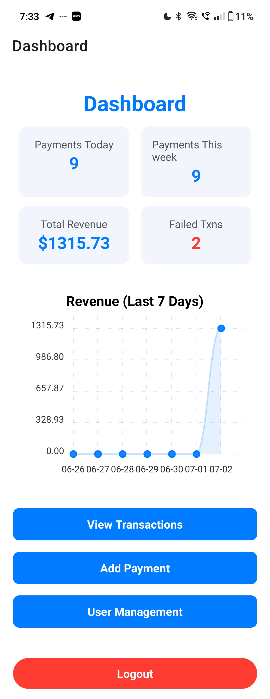

# Payment Dashboard App

A full-stack, mobile-first Payment Management Dashboard built with **React Native (Expo)** and **NestJS**.

---

## Features

### Backend (NestJS + Prisma + PostgreSQL)
- JWT Authentication (admin/viewer roles)
- Payments: CRUD, filtering, pagination, stats, CSV export
- User Management: Admins can add/view users
- WebSocket real-time updates
- CSV export (web & mobile)
- Basic tests (Jest + Supertest)

### Frontend (React Native/Expo)
- Secure login (JWT, error handling, polished UI)
- Dashboard: metrics, revenue chart, real-time updates, admin-only user management
- Transactions: paginated, filterable, real-time, exportable, empty state, polished cards
- Transaction details: color-coded, card layout
- Add payment: form with validation, modern design
- User management: admins can add/view users
- Navigation between all screens
- Secure JWT storage (web/native)
- Responsive & accessible

---

## Tech Stack
- **Frontend:** React Native (Expo), react-navigation, axios, react-native-chart-kit, socket.io-client, expo-secure-store, @react-native-picker/picker, expo-file-system, expo-sharing
- **Backend:** NestJS, Prisma, PostgreSQL, @nestjs/jwt, @nestjs/websockets, bcryptjs
- **Testing:** Jest, Supertest

---

## Folder Structure

```
/client
  App.tsx
  index.ts
  app.json
  /assets
    adaptive-icon.png
    addPayment.png
    favicon.png
    icon.png
    logo.png
    splash-icon.png
  /src
    /screens
      DashboardScreen.tsx
      UserManagementScreen.tsx
      LoginScreen.tsx
      TransactionListScreen.tsx
      AddPaymentScreen.tsx
      TransactionDetailsScreen.tsx
    /services
      api.ts
    /utils
      auth.ts

/server
  /src
    /auth
      auth.controller.ts
      auth.module.ts
      auth.service.ts
      jwt.strategy.ts
      ...
    /payments
      payments.controller.ts
      payments.module.ts
      payments.service.ts
      payments.gateway.ts
      ...
    /users
      users.controller.ts
      users.module.ts
      users.service.ts
      ...
    app.module.ts
    main.ts
  /prisma
    schema.prisma
    seed.ts
    /migrations
      /20250703043644_init
        migration.sql
      migration_lock.toml
  docker-compose.yml
  ...
```

---

## Setup Instructions

### Prerequisites
- Node.js (v16+ recommended)
- PostgreSQL database (or use Docker)
- Expo CLI (`npm install -g expo-cli`)

### Backend Setup
1. **Install dependencies:**
   ```sh
   cd server
   npm install
   ```
2. **Configure environment:**
   - Copy `.env.example` to `.env` and set your `DATABASE_URL`.
3. **Prisma setup:**
   ```sh
   npx prisma migrate dev --name init
   npx prisma generate
   npx prisma db seed
   ```
4. **Start the server:**
   ```sh
   npm run start:dev
   ```

### Docker Setup (Database Only)

> **Warning:** Make sure port **5432** (PostgreSQL) is free before starting the Docker container. Stop any local PostgreSQL or other services using this port.

You can run the **database only** using Docker:

1. **Navigate to the server directory:**
   ```sh
   cd server
   ```
2. **Start the PostgreSQL container:**
   ```sh
   docker-compose up -d
   ```
   This will start the PostgreSQL database.

- The database will be available at `localhost:5432`  
  (user: `postgres`, password: `password`, database: `db_payment`).

> **Note:** You still need to run the backend server (`npm run start:dev`) separately on your host machine.

### Frontend Setup
1. **Install dependencies:**
   ```sh
   cd client
   npm install
   npx expo install
   ```
2. **Configure API base URL:**
   - In `src/services/api.ts`, set your backend IP address (for mobile, use your local network IP).
3. **Start the app:**
   ```sh
   npx expo start
   ```
   - Scan the QR code with Expo Go, or run on web/emulator.

---

## Sample Credentials
- **Admin:**  
  Username: `admin`  
  Password: `admin123`

- **Database:**  
  User: `postgres`  
  Password: `password`  
  Database: `db_payment`  
  Port: `5432`

---

## API Endpoints
- `POST /auth/login` — Login, returns JWT and user info
- `GET /payments` — List payments (filters, pagination)
- `POST /payments` — Add payment
- `GET /payments/stats` — Dashboard metrics
- `GET /payments/export` — Export CSV (filters supported)
- `GET /users` — List users (admin only)
- `POST /users` — Add user (admin only)

---

## Real-Time & Export
- **WebSocket:** Real-time updates for new payments (dashboard, list)
- **CSV Export:** Works on both web and mobile (with JWT)

---

## Postman Collection

You can find the Postman collection for API testing here: [Payment Dashboard App Postman Collection](https://documenter.getpostman.com/view/37136017/2sB34bL3sd)

---

## Screenshots / Demo

Below are screenshots of each main screen (see the `screenshots/` folder for full-size images):

- **Login Screen**
  
  

- **Dashboard Screen**
  
  

- **Transaction List Screen**
  
  

- **Transaction Details Screen**
  
  

- **Add Payment Screen**
  
  

- **User Management Screen**
  
  

---

## License
MIT

---

## Notes
- For production, restrict CORS and secure JWT secrets.
- For mobile, ensure your backend is accessible via your local network IP.
- All icons/images should be placed in `client/assets/`. 